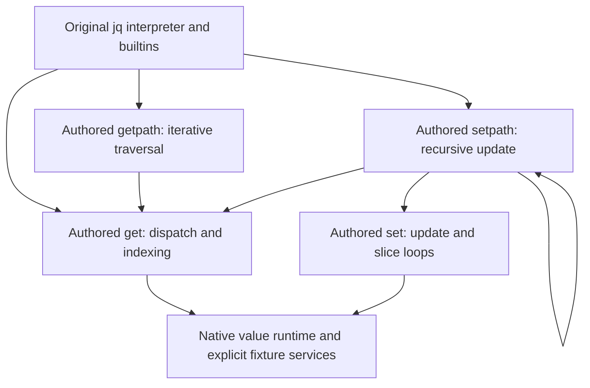

# Larger jq workflow assessment — 2026-09-16

The component workflow works on a larger, meaningful jq subsystem. It lets us
edit a supplier, retain unaffected local evidence, find a behavioral defect,
replay it after repair, and run the selected components through real jq consumers.
It is not yet an adequate default assurance workflow for ownership-sensitive
programs: an intentional reference leak passed every ordinary observation.

This assessment adds four operations to the earlier concat/append experiment.
It does not mark the whole jq target lifted or alter the contextual-bisimulation,
strong dispatch/link, portability, export, or repository acceptance obligations.

## Current implementation follow-up

Priority update (2026-09-21):
[the next practical milestone](whole-target-independent-lifting.md#practical-subsystem-milestone-and-sequencing)
extends this consumer network into authored array storage and lifetime operations.
Replacing that stateful behavior, including shared mutation and allocation,
is a different result from instrumenting transport around native `jv` services.
The prior F1–F7 results below remain scoped workflow evidence; P1–P4 are still open.

The [array storage follow-up](../tests/fixtures/jq-array-storage/README.md) now
implements seven ordinary C operations beneath these four path/value callers.
The connected workflow and its assembled experimental configuration both pass
37 cases, including ten native interpreter programs. A setter edit compiles one
translation unit and reuses 28; a wrong copy-on-write condition exposes retained
alias changes, including inside the interpreter. The public walkthrough replays,
repairs and reuses evidence. Formal results remain unavailable and do not block
this explicit experimental configuration.

The cleanup follow-up now detects actual allocation-lifetime differences through
those consumers and passes nineteen retained/generated storage sequences. Local
assembly checks also exposed an accidentally repaired original NaN-index reference
leak. An explicit C adapter preserves it; the revised setter passes 29 local cases
and the connected network passes 38. Its public edit/replay/repair/reuse workflow
passes with 36 lifetime-only negative discrepancies and zero-work neighbor reuse.
These checks remain scoped by their observation windows and retained native
dependencies. Allocation-failure composition, native foreign-destructor crossings,
controlled dependency isolation for this storage network, representation changes,
initial setup ergonomics and different-target reuse still prevent
practical-milestone completion.

The [current goal](current-goal.md) and
[behavior-faithful workflow plan](behavior-faithful-component-workflow-plan.md)
track the implemented response. The rest of this assessment preserves the initial
experiment and its counterexamples; its original limitations are historical,
not a current capability inventory.

| Initial shortcoming | Current response and remaining limit |
|---|---|
| Missed reference leak | Standard contract-specific instrumentation detects it without driver changes. Native heap/service internals remain unobserved. |
| Bespoke setup | Shared service definitions generate mechanical interfaces, adapters and observations. Target semantics still require authored adapters. |
| Flat composition | Explicit requirements resolve composed getpath and its get supplier transitively. The graph is declared, not a checked call graph or summary. |
| Floating interfaces | Binary32/64 render, compile and cross native adapters; numeric normalization is authored C. Floating arithmetic/fenv proofs remain unavailable. |
| Broad recompilation | Per-TU cache recompiles one edited unit and reuses 13 network objects. Unread-header and unaffected-neighbor checks perform zero compiler/link/model/solver/execution work. Unsupported preprocessing conservatively recompiles. |
| Runtime hang and validation cost | Owned bounded sessions/capture/cleanup run under headless Wayland. Cached catalog parsing reduces repeated evidence-validation cost; runtime and validation still dominate end-to-end edits. |
| Limited local formal assurance | An optional existing shared-view/service theorem is exposed through the comparison workflow. It has accepted, disproved, unsupported and exact-reuse cases; it does not prove jq's opaque heap. |

F1–F7 have terminal acceptance and repository evidence within the documented
scopes. The corrected 250-derivation aggregate and current focused Nix checks
pass; the final audit binds current implementation hashes to the retained
walkthrough. The controlled getpath experiment in
[the fixture](../tests/fixtures/jq-path-controlled/README.md) removes the get body
on both sides. Preserving a scoped original defect is allowed; declaring a false
contract premise does not establish applicability. No blanket borrow-checker or
memory-safety requirement was introduced.

## Initial experiment scope

The [reproducible fixture](../tests/fixtures/jq-path-network/README.md) contains
186 lines of authored C across value get/set and path get/set. This is a connected
subsystem with mutable shared values and several control structures, rather than
an exercise in adding component names.

All four units have independently compiled V5 interfaces and source packages.
The initial full comparison selected three suppliers explicitly; current packages
resolve the get supplier through composed getpath. The driver also composes
setpath with getpath to observe readback. Its ten interpreter cases exercise
builtins, nested assignment, slice replacement, a 64-iteration reduction, path
enumeration, shared inputs, caught errors, multiple outputs, negative indices,
and Unicode slicing. Native entry counters verify the authored network is used.

The original is the retained patched PE32 library, not a recompiled source
oracle. Its SHA-256 is
`50d05ffd1f3cdbb5257f2cda429d9b920d95c091bb88a9d8bcdcb08ae9bacb1d`.
The jq source archive is
`2be64e7129cecb11d5906290eba10af694fb9e3e7f9fc208a311dc33ca837eb0`;
the packaged depth-limit patch is
`120cd1d9368f9ef2a5dc141ebd6118b006d6f6e2a0627d72fe345efc8c38e98e`.
Inspecting that patch mattered: unpatched 1.8.1 source omits a behavior present
in our actual oracle. Inputs and tool identities are retained in each package.
No original, extraction, semantic-model, or strong-proof pilot rebuild was needed.

Native allocation, reference counting, leaf collection operations, error
formatting, numeric normalization and the retained `parse_slice` helper remain
unlifted services. Authoring used available upstream source as well as the native
oracle. Consequently this experiment measures component authoring and assurance,
not automatic discovery, binary-only recovery, or complete portable replacement.

## Results and exact retained evidence

Evidence root: `build/jq-path-network-2026-09-16/`.

| Exercise | Result | Evidence |
|---|---|---|
| Four isolated operations | 106/106 paired cases match | `workflow-v2/*-baseline/comparison-result.json` |
| Getpath with authored get | 26/26 match | `workflow-v2/path-get-network-baseline/` |
| Four-operation network | 37/37 match, including ten actual interpreter programs | `workflow-v2/path-set-network-baseline/` |
| Compatible get-body edit | Supplier and integrations rerun; three unaffected isolated units reuse with all work counts zero | `workflow-v2/*-edited/` |
| Deliberate negative-index bug | Local get returns 20 instead of 30; network readback and a real interpreter program also diverge | `workflow-v2/value-get-wrong/`, `network-wrong/` |
| Replay after repairing the draft | Retained bad inputs still reproduce the mismatch | `workflow-v2/retained-replay/` |
| Repair | Supplier and full network reuse the earlier matching edited evidence, with zero work | `workflow-v2/*-repaired/` |
| Same signature, changed assumptions | Supplier replacement rejected with `dependency contract changed` | `workflow-v2/changed-contract.stderr` |
| Experimental build and execution | All four selected definitions admitted; existing binary reused; 37/37 runtime cases pass | `workflow-v2/experimental/`, `experimental-run/` |
| Deliberate reference leak | Ordinary 26-case getpath corpus still matches | `workflow-v2/undetected-reference-leak/` |
| Strengthened ownership observation | Same leak gives root reference count 2 versus 1; repaired source matches | `blindspots-v1/leak-detected/`, `repaired-with-refcount/` |
| Unread header edit | Confirmed absent from compiler dependencies, but invalidates and recompiles all seven local translation units | `blindspots-v1/unread-header-edit/` |
| Float boundary and nested package selection | Reproducible explicit rejections | `design-probes-reproduced.json` |

`workflow-v2/audit.json` retains 28 public commands and 19 comparison results.
All results remain non-authorizing. `--local-contracts` reports **unavailable**:
`readonly_summary_contract_shape_unsupported`. It currently requires a stateless,
service-free interface with fixed readable views and scalar results. No solver
queries ran for these jq components; the fast results are not fast formal proofs.
The interpreter uses test-only entry redirection, not strong native-link receipts.

Initial unsuccessful trials are also retained: `smoke-get/` rejected an unused
static function in the upstream header under `-Werror`; `smoke-get-v2/` found
non-ASCII command-line corruption. Fixture-only header warning scoping and ASCII
JSON transport resolved those setup failures. The earlier `workflow-v1/` exercised
the same four operations before adding interpreter consumers.

## Cost and invalidation

These are observed local wall times, not controlled benchmarks. The first and
expanded walkthroughs overlapped briefly, so individual timings include host
contention. Preparation of the packages reuses retained inputs and takes well
under one second; it invokes no compiler, model builder, solver, or linker.

| Operation | Wall time | Compiler / link / executions |
|---|---:|---:|
| Isolated get, 26 pairs | 12.22 s | 7 / 1 / 52 |
| Isolated set, 27 pairs | 13.32 s | 7 / 1 / 54 |
| Full network, 37 pairs | 17.11 s | 13 / 1 / 74 |
| Edit get; reuse isolated set/getpath/setpath | 0.41 / 0.42 / 0.43 s | 0 / 0 / 0 each |
| Edit get; recheck full network | 16.05 s | 13 / 1 / 74 |
| Repaired full network, retained matching evidence | 0.72 s | 0 / 0 / 0 |
| Experimental build from existing binary | 0.92 s | 0 / 0 / 0 |
| Experimental runtime, 37 cases | 174.67 s | 0 / 0 / 37 |

The fresh network receipt separates preparation (0.041 s), compiler (0.525 s),
link (0.164 s), execution (15.815 s), teardown (0.130 s), and hashing (0.005 s).
Model and solver counts are both zero. Execution time includes Wine startup;
phase totals do not account for every part of command wall time.

The complete expanded walkthrough took 361 seconds across its public commands.
The experimental runtime was almost half of that time, despite running half as
many executable invocations as the 17-second comparison. This is orchestration
cost, not evidence that the component algorithms are expensive. The comparison
keeps its Wine servers alive and writes process output to files. The experimental
runner uses pipes and does not request persistent servers. Its ordinary cases
consistently take about 4.6 seconds.

A separate assay used the same admitted per-case API and retained executable,
then enabled Wine server persistence. This exposed a second issue: the first
persistent-server case hung beyond its 30-second deadline. The timeout handler
kills the process group, but its last `communicate()` is unbounded; detached Wine
processes can retain pipe writers. Stopping only that assay's server from its
still-running headless desktop released it. Evidence is in
`runtime-costs-v1/intervention.json` and `True-0/candidate-test-case-report.json`.
The subsequent rows labelled persistent are not valid persistence measurements,
because the intervention stopped the server. The assay terminated with exit 1
after its final server-stop command found no live server. No speedup is claimed
from this failed assay. Simply adding `wineserver -p` to the experimental runner is therefore
insufficient: session management, output capture and bounded cleanup need to be
handled together, while retaining per-case admission.

The walkthrough temporarily retained approximately 23 GiB, primarily disposable
Wine prefixes. Retained compiler inputs, observations and receipts are much
smaller. Small component bodies do not solve runtime setup, evidence storage,
or overly broad invalidation.

## Shortcomings exposed by the initial experiment

1. **Ownership is mostly a promise in this workflow.** The raw value transport
   hides reference identity and lifetime from the interface. Empty effects and
   checked-interaction lists do not prove the described consume/borrow rules.
   A real excess-reference bug passed all 26 getpath cases. A root reference-count
   check caught this example, but is not a general lifetime theorem or permission
   to require identical internal reference counts across representations. We need
   reusable logical ownership/handle checks, retained-alias observations and
   controlled service failures, with explicit limits for each checker.

2. **Preparation still requires too much bespoke machinery.** Four short C units
   required a target-specific schema/service catalogue, bridge generation, object
   factories, observation selection, flat network wiring, native ingress fixture,
   error services and packaging. Most operator effort went here, not into the
   algorithms. The existing constructors were sufficient; no engine change was
   needed. That is encouraging architecturally but not yet an ergonomic user
   experience. Shared typed service and fixture definitions should remove this
   duplication without creating another contract format.

3. **Composition is manually flattened.** Selecting the already-composed getpath
   package as a supplier fails with `select dependency bodies explicitly; nested
   selections are not imported`. The operator must enumerate get, set and getpath
   and wire calls in C. A four-unit network is manageable; a hundred-unit network
   needs a visible, validated dependency closure and useful provenance. Explicit
   choices and contract checks must remain reviewable, including recursive groups.

4. **The source-facing type support is narrower than the schema.** A binary64
   service result passes schema construction but fails C rendering with
   `V5 component C does not support plain boundary type 'float'`. Numeric index
   clamping/NaN handling had to move to a native fixture service. This preserves
   an explicit boundary but shifts portable logic into target-specific glue.
   A supported-type diagnostic and ordinary scalar rendering would improve this
   substantially without relaxing proof authority.

5. **Invalidation is conservative and compilation is not incremental.** One
   supplier edit recompiles all 13 network translation units. Worse, editing an
   unused header alone recompiles seven local units and reruns the selected case,
   despite the compiler proving it did not read that header. A more precise
   per-unit input/compile cache should preserve compiler configuration, include
   resolution, generated ABI and evidence bindings. Isolation already excludes
   other authored bodies; it does not exclude native callee code from the oracle
   or prove independence under arbitrary contract-compatible implementations.

6. **The case corpus and ingress remain handcrafted.** Output equality can miss
   leaks, sharing changes, nondeterminism, performance regressions and unvisited
   outcomes. Setup asserts selected aliases, but observations do not reconstruct
   the heap or establish preserved lifetime. Cases include depth 128 and rejected
   depth 10,001, not all accepted depths or stack exhaustion. Allocation failure,
   reentrancy, callbacks and concurrent mutation are not covered. The interpreter
   bridge is pinned to one image and leaves original bodies present. A portable
   export and supported runtime replacement are still separate work.

7. **Runtime deadlines need stronger cleanup semantics.** The ordinary public
   walkthrough passed, but the persistence assay hung after its declared timeout.
   A timed-out root process and a drained output pipe are different conditions.
   Detached runtime helpers need explicit lifecycle ownership, and output
   collection must remain bounded after escalation. This affects reliable
   operator cancellation as well as throughput.

8. **Assurance labels remain necessary.** Signature stability does not imply
   compatible effects or ownership. Contract-text changes are correctly rejected,
   but the tool does not establish semantic compatibility between different
   contracts. The current optional checker cannot handle this service-bearing
   family. Reused local comparisons are useful practical evidence, not reused
   contextual-bisimulation proofs or activation permission.

## Recommended next work

The [accepted follow-up plan](behavior-faithful-component-workflow-plan.md)
supersedes the sequencing and resource-policy recommendations below. In
particular, detecting the injected leak means reporting an unexpected resource
effect and checking the selected contract; a leak diagnostic is not a universal
equivalence failure. Explicitly scoped original defects may be preserved, and
false composition premises must remain visible. The experiment results above
are unchanged.

Keep these four components as the acceptance consumer. Improve the shared `jv`
service boundary and observation tooling first: make the leak negative control
fail by default, exercise consume/borrow violations and retained aliases, and
record what remains unobserved. Add controlled error outcomes so local checks can
exercise a contract rather than depend entirely on native callee implementations.

Then make preparation and composition smaller: reuse typed service definitions,
generate bridges where mechanical, and resolve an explicit selected dependency
closure. Complete scalar C rendering and report unsupported contracts before
operators have written adapters around them.

For performance, fix runtime session orchestration and measure it separately from
proof time, then cache compilation per unit and narrow dependency invalidation.
Preserve admission checks and exact evidence binding. These changes address
measured costs; increasing component counts or rebuilding the pilot would not.

Only after those changes should another substantially different jq subsystem
serve as the next generality trial. This experiment supports the direction, while
showing that trustworthy defaults and boundary preparation are now more urgent
than further demonstrations of source editing alone.

## Validation and retained workspace

The current engine reloaded and validated all 24 final comparison receipts and
the four-component experimental manifest (`final-evidence-audit.json`). Repository
metadata freshness, fixture Python lint, and `git diff --check` passed. Formatting
the preparation scripts reproduced all six packages byte-for-byte
(`formatted-reproduction.json`); the type and composition probes were repeated.
The intentionally mismatching, leaking and timed-out trials remain labelled as
such, separate from the matching repaired network.

Production engine, Nix constructors and target definitions were not changed by
this experiment. Full strong-proof pilots were not rerun. Unrelated existing
worktree changes were preserved. Terminal Wine prefixes from this experiment
were removed after measurement; `disposable-prefix-cleanup.json` records the
paths and space, while inputs, binaries, observations and receipts remain.
