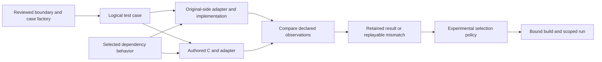

# Practical lifting workbench: sketch and design review

Status: accepted design review, 2026-09-15. This review refines the
[practical independent lifting design](practical-independent-lifting-design.md).
Implementation progress and remaining validation are recorded in the
[current goal ledger](current-goal.md). The accompanying conversation mockup
uses simulated results and illustrative helper names; use the linked fixture
walkthroughs in that ledger for implemented commands.

Sequencing update (2026-09-21): the operator reaffirmed this practical direction.
The next accepted milestone is now
[P1–P4: connected stateful lifting and different-target reuse](whole-target-independent-lifting.md#practical-subsystem-milestone-and-sequencing).
It extends the implemented jq workflow into authored storage/lifetime behavior,
then exercises the same facilities on a connected DX-Ball lifecycle. The narrower
sequence below records the original workbench delivery design; universal proof
closure is not a prerequisite for the new practical milestone either.

Reaffirmed 2026-09-22: the [operator handoff](current-goal.md#operatorprogram-handoff)
requires repeatable first-time boundary setup and connected consumer execution,
not only editing packages prepared by a tool developer. Manual declarations using
documented authoring APIs and reusable C adapters are acceptable; per-unit checker
or tool-internal development is an unresolved workflow gap. Publish experimental
checkpoints with their actual scope before later whole-program qualification.

The subsequent [connected DX-Ball walkthrough](../tests/fixtures/dxball-graphics-network/README.md)
now repeats the jq workflow with manually defined graphics state, controlled
resource services and actual initialization/reset/bind/blit operations. The bounded
P1–P4 implementation milestones are delivered: public editing, discrepancy replay,
unaffected-neighbor reuse and experimental assembly run without a per-unit toolkit
extension. Manual adapter work remains substantial; this does not establish broad
Win32 coverage, native DirectDraw execution or the later G1–G7 claims.

The current reprioritisation keeps this workflow primary after those bounded
examples pass. The [native Hello handoff](../tests/fixtures/hello-native-quoting/README.md)
now passes the public sequence with actual callers and lower services. The fresh
setup follow-up removes a historical authored-package dependency and consolidates
supplier binding across Hello, jq and DX-Ball. Use that reproducible setup to
extend connected coverage; consolidate further setup when actual use justifies it.
Judge the next checkpoint by reproducible operator actions and edit/diagnosis
costs. Completion of P1–P4 does not itself promote broader formal closure to the
next task; stronger whole-program acceptance retains its separate obligations.
The handoff is now delivered; [standalone delivery](current-goal.md#next-delivery)
is the concrete queue.

The subsequent [portable jq handoff](../tests/fixtures/jq-portable/README.md) now
transfers source assembly and public source updates beyond Hello. The same twelve
components run through jq's normal CLI, with explicit unlifted source dependencies,
on x86-64 and AArch64. Program comparisons expose a DLL/import callback-identity
defect that stock source assembly would silently repair. C bindings preserve it.
The edit workflow also exposes unnecessary library-wide object invalidation;
one shared exporter fix now preserves unaffected ordinary make outputs. Record
that as tool development required during the trial. The result is a portable
partial lift with concrete program/memory observations, not complete jq recovery
or independent human usability evidence. These integration findings support the
operator-driven sequencing and separate practical/strong completion criteria.

The optional source-backend failure consumer then reuses the same C observer
through portable linker wrappers. Seven selected failures match on both
architectures, including actual interpreter/handler delivery; an extra retained
reference is detected and replayed. A cold thread-context allocation differs with
pointer width and remains explicit, while the initialized component comparison
matches. This illustrates why a usable boundary needs initialization and lifecycle
knowledge in addition to a function signature. It adds no proof/checker machinery
and does not expand the twelve-component network.

The [local workspace/string-length trial](../tests/fixtures/jq-string-length/README.md)
then gathers the existing boundary knowledge into generated guides and local
`component status --comparison-package`. A new real boundary reuses shared string
service declarations, live views and adapters without a new semantic rule. Local
editing, defect replay and neighbor reuse pass, followed by normal source-program
execution on both architectures. This is evidence that shared facilities can
reduce repeated setup; it is still source-assisted agent work, with manual native
hooks/cases and a reviewed backend binding. It does not establish that unfamiliar
operators can partition arbitrary programs without toolkit changes.

The source-integration follow-up removes another repeated setup dependency:
assembling the portable jq project no longer reopens native comparison packages
to reconstruct bindings. The exported library retains the original binding
references; a shared reader and the existing C generator accept explicit backend
selections. The same source inputs and executables are preserved, including
neighboring build outputs. This improves the handoff without extending component
counts or proof rules. Operator-owned C semantics and program validation remain
necessary, and binding examples are not automatically portable implementations.

The subsequent [new jq string-slice trial](../tests/fixtures/jq-string-slice/README.md)
tests that queue on shared string contents and nonlocal allocation failure through
the real interpreter. The existing memory/handler facilities suffice, but initial
preparation exposed a shared validation gap: plain scalar indices were forced to
carry resource roles. The validator now admits those ordinary values while keeping
ownership mandatory for resource-bearing inputs/results. Record this as required
tool development during the fresh trial; later successful prepared runs do not
erase that operator-ergonomics finding. Its allocation-order mutant passes ordinary
calls and runtime allowances but fails reference/lifetime observations on actual
allocation failure, reinforcing the need for several independent observations.

The later 2026-09-22 priority pass makes that queue finite:
[H1–H3](whole-target-independent-lifting.md#h1h3-operator-handoff-and-program-execution)
require fresh-input operator setup, the current Hello selection through normal
program entry, and reuse of the setup/runtime facilities on connected DX-Ball.
Hello routine comparisons omit original startup/TLS; the separate normal-entry
workflow below closes that gap. Freeze the connected scope
and add operations only to resolve a selected workload or executable interaction.
The later side-thread review separates eventual completion as well as sequencing:
[practical product delivery](whole-target-independent-lifting.md#practical-product-completion)
requires new-boundary operator use, standalone source, reusable platform backends
and another architecture. G1–G7 remain a separate strong-assurance objective.
Their proof standards are unchanged; universal qualification is not a prerequisite
for declaring the practical product useful within its documented scope.

The [fresh-input handoff](../tests/fixtures/hello-handoff/README.md) now reproduces
Hello and DX-Ball without prior comparison output, using the shared lifting shell
and existing authoring APIs. Both public edit/replay/reuse/experimental workflows
pass, as does the connected jq regression. This is prepared-example reproduction.
H1's subsequent [previously unprepared string-conversion trial](../tests/fixtures/hello-string-conversion/README.md)
now passes, with analysis/adapter effort recorded separately from package preparation
and warm edits. It required ordinary declarations, C and target adapters, with no
new checker, production artifact reader or compiler machinery. The subsequent
[normal-entry Hello workflow](../tests/fixtures/hello-program/README.md) now passes
through original startup and both TLS callbacks. It detects and replays a decoded
character defect that a selected native routine case misses, then verifies repair.
This illustrates why actual program workloads are their own acceptance step.
The [source-library handoff](../tests/fixtures/hello-source/README.md) now exports
the compared C and interfaces through existing source packages and builds outside
the checkout. Complete application/runtime source closure, portable backends and
execution on another architecture remain open; library compilation is not that
whole-program exit.

The trial exposes the knowledge needed for local work: inputs, shared objects,
services, outcomes, examples and assumptions, with shared layouts and lifecycle
conventions defined once. Surrounding-code investigation belongs to establishing
or changing a boundary. Ordinary C edits should remain local while affected
integration tests rerun. A checker/artifact/compiler change needed for the new unit
counts as a tooling gap, even if a developer can make its prepared example pass.

This closes the bounded H1–H3 handoff, not general product readiness. Preparation
remains disproportionately manual: 51 lines of algorithm needed 230 C adapter/driver
lines, 35 declaration lines and executable setup/integration recipes. The first
working boundary/adapters took 503s of recorded agent wall time, while automatic
package preparation took 0.246s. That timing includes automated work and excludes
initial inspection; it is not a human usability measurement. Warm editing compiles
one unit and reuses the unaffected neighbor without work. The conservative full-
environment cache still invalidates receipts across desktop sessions. Reusable
adapter templates, better workspace navigation and explicit environment inputs
are measured ergonomics opportunities; none warrants an architectural restart.
The subsequent standalone source/runtime/other-architecture delivery now passes
within its Windows-1252/redirected-stream scope, including portable UTF-8 entry,
output failures and controlled application-allocation failure. A fatal handler
that prints the right diagnostic but exits successfully is detected/replayed/
repaired through actual program execution on the same source workflow. Physical
memory exhaustion and general terminal/locale coverage remain unobserved.
Use the standalone-source handoff to identify remaining adapter/assembly effort
and concrete runtime needs. Keep stronger formal qualification available as its
separate objective; more prepared fixtures alone do not establish usability.

The standalone handoff subsequently found a concrete tooling gap: a checked C edit
could not refresh the existing source library through the public exporter. The new
`candidate export --update` operation preserves application/backend work and notes,
retains a backup and rejects changed boundaries or conflicting edits. The complete
Hello component/check/update/program sequence now passes, with zero-work neighbor
reuse and retained mismatch replay; the export/update/build facility also transfers
to jq. This required a shared tooling improvement, not target-specific proof rules.
The measured local check spends 9.495s in Wine startup versus 0.033s compiling the
edited unit. The subsequent concurrent fresh-prefix checkpoint reduces that
check from 14.513s to 8.648s, with the edit/update/defect/replay/repair workflow
and connected target regressions still passing. State remains separate between
comparison sides and cases remain ordered. Initial boundary/adapter effort is now
the next operator trial; more runtime benchmarking or proof closure is not the
default follow-up to this bounded performance improvement.

The subsequent [previously unprepared stream-close trial](../tests/fixtures/hello-stream-close/README.md)
uses existing declarations, generated bridges and native helpers to establish a
consuming stream boundary, author C, expose errno/lifetime defects, reuse its
neighbor and run through normal shutdown on both architectures. No per-unit checker,
artifact or compiler extension is required. Manual ABI/service analysis,
observations and assembly dominate initial work. This supports the architecture
and supplies an effort inventory; broad human usability and universal target
coverage remain unestablished. Transfer to a retained non-Hello consumer dependency
is the next useful trial.

## Assessment

The operator reaffirmed after the console follow-up that testing depth must serve
workflow usability. A backend experiment can stop with an explicit unsupported
case; it must not become an open-ended fidelity campaign. The current workspace
handoff now carries concrete check/reuse/export commands and reports its runtime
requirements. The next useful work is reducing first-boundary preparation and
adapter effort through an actual operator task.

The direction is sound: a useful executable boundary, an original implementation
as an oracle, ordinary source editing, concrete comparisons and optional focused
proofs. The main danger is replacing universal proof obligations with equally
expensive requirements to specify every dependency and construct a universal
test environment before an operator can change anything.

Begin with one test driver that can invoke two implementations. Generate routine
transport and test scaffolding; allow reusable, explicit fixture code for the
parts that cannot yet be generated. Introduce dependency isolation where it pays
for itself. Keep the language small if that makes the complete workflow coherent.
Formal independence and sampled experimental confidence remain different claims.

The [byte-length trial](../tests/fixtures/jq-string-byte-length/README.md) provides
a concrete interface-design finding. Reusing the string contents declaration was
insufficient because its C adapter called the operation being lifted. Reviewing
that implementation dependency and factoring one shared live-object view made the
new boundary executable without changing tool internals. Returned lengths alone
missed a release defect; existing reference/lifetime observations caught it.
The source program then passed its existing consumers on x86-64 and AArch64.
Boundary setup still needs semantic analysis and an explicit program binding;
ordinary implementation edits use the recorded boundary. Unchanged local fixtures
reuse, while changed shared adapters and whole-program selections are rechecked.

## 1. A restricted dialect with complete tool support

The [2026-09-25 module workflow](component-module-workflow.md) implements the
practical/formal split below for immutable static storage and carries grouped
portable entry adapters through assembly. The strict proof profile remains intact.

The operator explicitly permits a restricted C dialect if the infrastructure
supports it ergonomically. Prefer a subset of standard C, compiled with ordinary
toolchains, over a new language or mandatory annotations on every expression.

The current `portable-component-c11-cbmc-v1` profile in
[`source_profile.py`](../src/spaghetti_extractor/components/source_profile.py)
already rejects unrestricted allocation, mutable globals/static storage,
conditional compilation, volatile storage, atomics and several other constructs.
[`source_check.py`](../src/spaghetti_extractor/operator/source_check.py) invokes
that profile before dispatching further checks. This is a real integration point,
not a reason to immediately accept unrestricted C.

Separate the following questions in orchestration and feedback:

| Question | Required to do what? |
|---|---|
| Does the code conform to the selected C dialect and compile? | Build that component |
| Can its inputs, state and calls be transported by implemented adapters? | Execute that boundary |
| Can a selected formal rule express this boundary and implementation? | Run that formal check |
| Do the selected practical results and assumptions meet project policy? | Try that experimental configuration |
| Are strong qualification and portability obligations complete? | Make the corresponding stronger claims |

Dialect validity must not depend on whether this particular stateful component
has an implemented proof rule. Conversely, making proof optional does not make
unimplemented runtime bindings usable.

The initial dialect should support normal control flow and local structs/arrays,
explicit state access and generated typed calls. Resource allocation, shared
objects and platform interactions can use ordinary C helper APIs whose adapters
provide executable meanings. The author should see `text_data(view)` or
`value_retain(ctx, value)`, not manually reconstruct addresses in a machine model.
These names are examples, not existing APIs. A helper is not available until its
runtime and local-test adapters exist; a declaration alone is insufficient.

Ergonomic acceptance includes generated headers, compiler/editor configuration,
examples, source locations for violations and actionable alternatives. For an
unsupported direct allocation, show the supported allocator helper and ownership
convention. Keep dialect rules stable and documented; version semantic changes.
Existing proof readers retain their profile requirements until deliberately
adapted. Do not silently reclassify formerly rejected source as qualified.

This leaves low-level ABI recovery and unusual instructions in the original-side
adapters. A restricted authored language must not imply that the original binary
uses the same restrictions. An operation involving unsupported callbacks or
threads may initially stay in a larger original component. This postpones that
capability without claiming that it is covered.

## 2. Operator sketch

Use existing boundary and component workflows. The following is a proposed work
package layout and interaction, not literal new CLI syntax:

```text
Component: UI replacement
  Implementation   replace_selection.c + generated component headers
  Boundary         text view, mode, current window, caption extent
  Dependencies     cleanup/resource operation; delivery service
  Local cases      ordinary path; skipped cleanup; changed window; failure

Check component
  C dialect / compile     supported
  Local comparison       mismatch at delivery
  First difference       expected current window B; observed old window A
  Next action            replay case, inspect the read before cleanup

After repair
  Local comparison       sampled cases match
  Formal check           unsupported state/service rule
  Next action            try experimental component-network run
```

The normal view emphasizes the source, boundary and first useful action. Put
assumption provenance, exact evidence inputs and detailed traces in an expandable
view. Avoid a single green component badge or a numerical confidence score.

The same public operations should be callable by an editor, CLI or assistant.
A new GUI is not a prerequisite. Generated artifacts are inspectable, but routine
edits must not require hand-changing digests, model code or Nix expressions.
Accepted experimental assumptions live in project configuration, so ordinary
edits do not prompt for repeated permission.

## 3. One driver, two implementations, explicit dependency choices



Each side receives a fresh object graph preserving the same logical aliases and
lifetime state. It must not receive shallow copies sharing mutable host storage.
External resources also need isolation or a supported controlled adapter.

| Dependency choice for this check | Setup and result |
|---|---|
| Pinned real implementations | Often simplest initially. Execute the actual suppliers; bind their bytes and relevant runtime inputs. Their edits can require rerunning this comparison. |
| Controlled responses | Supply explicit argument-sensitive behavior and writes. Exclude supplier bodies from that local execution. Consumer results can survive supplier edits; actual supplier conformance and integration remain separate. |
| Captured interactions | Reuse a supported recorded execution after validating incoming arguments and state. Add later where capture is easier than authoring useful cases. |

This choice belongs to the check, not permanently to the component. A component
can have a fast isolated check, an actual-dependency regression and a focused
proof. Mixed dependency choices are useful when supported, but are not required
for the first driver. Every result exposes which real implementations it used.

Build dependency isolation incrementally. Human understanding can remain local
even when a test runs neighboring code. Strong cache independence requires that
the test actually excludes those bodies. The completed formal caller reuse must
remain available; this proposal does not replace it with weaker test claims.

## 4. Examples that discriminate between good and bad designs

| Edit or failure | Required behavior |
|---|---|
| Read a window handle before cleanup that changes it | Report the first differing delivery argument, even if final return values agree. Replay shows state before and after cleanup. |
| Change a supplier body with the same contract | Keep an unchanged consumer's controlled-dependency result; rerun comparisons that executed the old supplier and affected integration. Show why each result is reused or stale. |
| Widen caption extent from 500 to 1,024 bytes | Revisit input construction and dependent checks despite an unchanged C signature. Report prior scope and new uncovered cases. |
| Narrow admitted inputs after finding a mismatch | Retain the counterexample, report its exclusion, and reassess callers. Do not silently erase the failure. |
| Change a jq value representation | Compare logical contents and sharing through explicit adapters; select all operations accessing the private representation together. An incompatible remaining reader prevents that mixed selection. |
| Miss a jq retain or release shared storage early | Include shared-value and failure cases with observable lifetime/content checks. If a controlled supplier concealed the mistake, integration exposes an unsupported assumption rather than retroactively turning the local result into unconditional evidence. |
| Callback mutates a DX-Ball handle during a service | Observe the state at the supported interaction points and sample the relevant schedule. An atomic service mock does not establish arbitrary reentrancy correctness. |
| Valid restricted C needs an unavailable proof rule | Compile, run local cases and permit an otherwise eligible experimental run. Report the exact unavailable proof, without a qualification claim. |

Proof regions, components and replacement groups remain separate: internal proof
cuts need not become production APIs, and several components may have to change
together when a representation crosses their interfaces. Splits still need valid
entry/continuation transport and preserved control-flow coverage. Tests do not
automatically establish completeness or progress.

## 5. The hard parts that remain

The core engineering challenge is an adequate executable boundary. An original
and lifted implementation can agree because the fixture or observer makes the
same mistake on both sides. Validate the infrastructure with deliberate alias,
argument, ordering, observation and lifetime errors, and use native-original
checks where available to challenge assumptions in recovered-C oracles.

Controlled responses must check call arguments and relevant current state before
applying writes. Otherwise a fixture can overwrite the incorrect state and hide
a bug. A replay must not silently realign changed call sequences. Alternate
implementation strategies need an explicit observation relation when their
internal event sequences legitimately differ.

General object capture, nondeterminism, callbacks and concurrency are substantial
future work. Begin with reusable constructors for bounded objects and named
service scenarios. No universal heap serializer or comprehensive Win32 mock is
required to establish the first useful workflow. Instrumentation records its
actual scope; neither tests nor a restricted dialect prove absence of all hidden
accesses, data races or undefined behavior.

## 6. Small implementation footprint

Reuse existing component identity, interface/binding/relation inputs, work-package
projections, testkit, native fixtures, Nix toolchains and artifact storage. Add
executable fixture descriptions where the current inputs cannot express them.
Do not create a second interface graph, generic mock language or status database.

One local result should bind source/oracle bytes, boundary meaning, fixture and
observer implementations, cases, dependency choice and actual tools/environment.
Reuse a suitable result family if its semantics fit. Timings are output data, not
part of semantic identities. Report preparation, compilation, model generation,
solver, test execution and linking separately, including skipped work.

An experimental execution manifest is justified by a distinct authority boundary.
Current strong checks occur in both
[`candidate-test-suite.nix`](../nix/candidate-test-suite.nix) and each case in
[`candidate-test-aggregate.nix`](../nix/candidate-test-aggregate.nix).
Share build/runner operations beneath typed qualified and experimental admission;
do not bypass only the outer gate or forge strong realization fields. Candidate-only
receipts cannot be relabeled as differential evidence without new semantics.

The first experimental run can be a component-network driver. Missing recovery,
transport or runtime support may still prevent a whole application build. Label
that scope, preserve the existing qualified link/export/portability obligations,
and do not call Wine execution a portable implementation.

## 7. A narrower delivery sequence

1. Publish the supported dialect and materialize an executable work package with
   one differential driver. Reuse retained Metapad inputs for quick regressions,
   then exercise a hand-defined jq shared-value consumer with multiple dependency
   operations. Pinned actual dependencies are acceptable initially.
2. Demonstrate the full edit loop: inject a real bug, compare, replay, repair and
   rerun. Confirm dialect-valid source remains testable when a formal rule is
   unavailable. Keep fixtures small and preparation cached.
3. Isolate one significant dependency with controlled responses. Demonstrate
   body absence, local consumer reuse after its implementation changes, and the
   distinct supplier/integration checks. Deliberately violate its assumption and
   show the failure. Retain an existing supported proof alongside practical results.
4. Build and execute the selected network under the explicit experimental policy.
   Reject stale binary bindings and experimental artifacts at every strong reader.
   Show that proof timeout/unavailability does not block an otherwise eligible run.
5. Extend the same public workflow to a real DX-Ball lifecycle/failure or supported
   callback consumer. Then demonstrate a compatible representation change.

Steps 1–4 form the first complete milestone, with intermediate steps individually
demonstrable. Success is a reproducible operator workflow and accurately bounded
reuse, not a count of components, schemas or new proof primitives. Avoid starting
with all oracle backends, an automatic boundary recommender, a new GUI or general
concurrency support. Those would obscure whether the basic interaction is useful.
